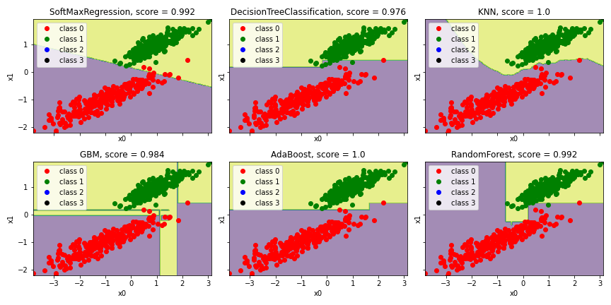

# All-models
Some my models for ML projects

Here I have collected some of my algorithms, written on Python from scratch:

- Soft Max Regression
- KNN
- Random Forest
- Decision Tree
- GBM
- AdaBoost

They all solve the same classification problem. Results are plotted on the same graph for comparing.

